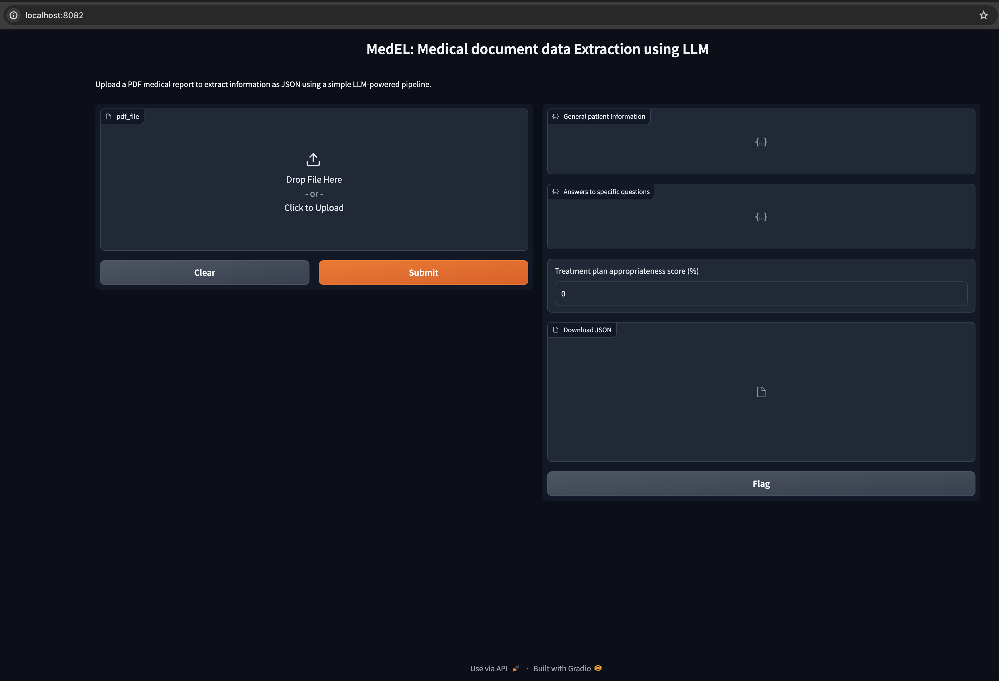
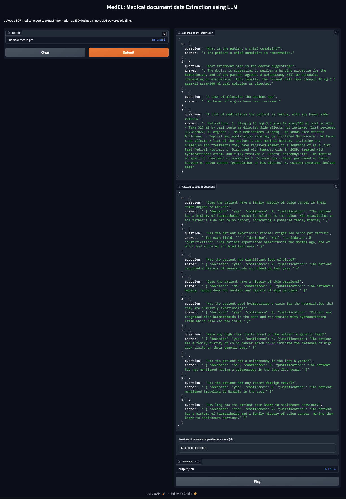

# `MedEL`: Medical document data Extraction using LLM.

This repository contains the source code to extract required information from a given medical document. 

### Steps to run locally

Concretely, the python (3.9 or higher) code written under main.py launches a gradio app on http://localhost:8082/, 
by simply running the following command from the current working directory:
```python main.py```

Although, for the above command to work, you need to install the requirements using 
```pip install -r requirements.txt``` and copy over a commercially usable LLM model from the following URL:
https://gpt4all.io/models/gguf/mistral-7b-openorca.Q4_0.gguf to the current working directory. 

### Steps to run using docker

To avoid all of these manual steps, you can use the Dockerfile to build a docker image with the following command:
```docker build -t my_gradio_app .```
Once the docker image is created, we can launch our gradio app inside a docker container with the following command:
```docker run --rm -it -p 8082:8082 --user=42420:42420  my_gradio_app:latest```

(ref: https://blog.ovhcloud.com/deploy-a-custom-docker-image-for-data-science-project-gradio-sketch-recognition-app-part-1/)

(NOTE: I used colima backend on my mac. Installed with `brew install colima` and activated with 
`colima start --cpu 8 --memory 16`)

At `localhost:8082`, you should see a screen as shown below:

<figure>
<p style="text-align:center">
  
  </p>
  <figcaption><i>MedEL gradio app landing page</i></figcaption>
</figure>


Upon uploading a medical report PDF file, you shall see an output similar to one shown below:

<figure>
<p style="text-align:center">
  
  </p>
  <figcaption><i>MedEL gradio app in action</i></figcaption>
</figure>


## Future work
- Using better LLM targeted towards or trained on medical reports data.
- Making lesser calls to LLM or parallelizing calls to reduce response time and resource utilisation.
- Optimally using hardware while running his app inside Docker
- Better prompts and/or prompt engineering to generate precise outputs
- More robust mechanism to generate the treatment plan appropriateness score
- Advanced features on the gradio app such as dynamically asking questions
- Offer support for jpegs or pdfs that need OCRing before the LLM layer